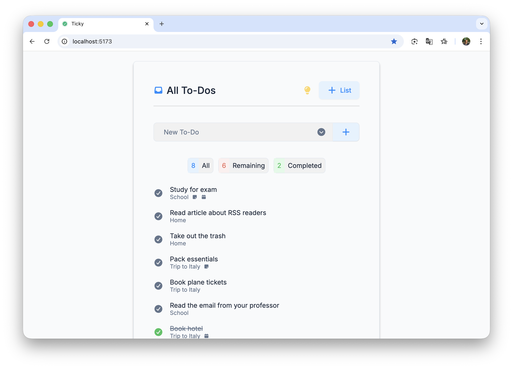
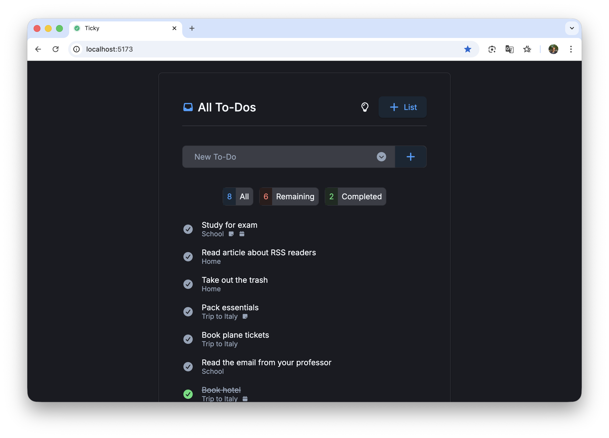
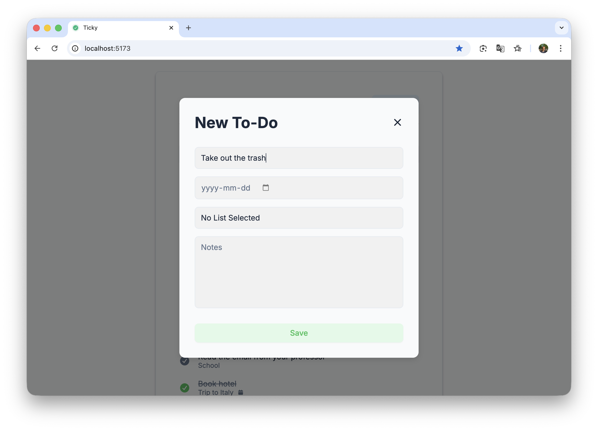
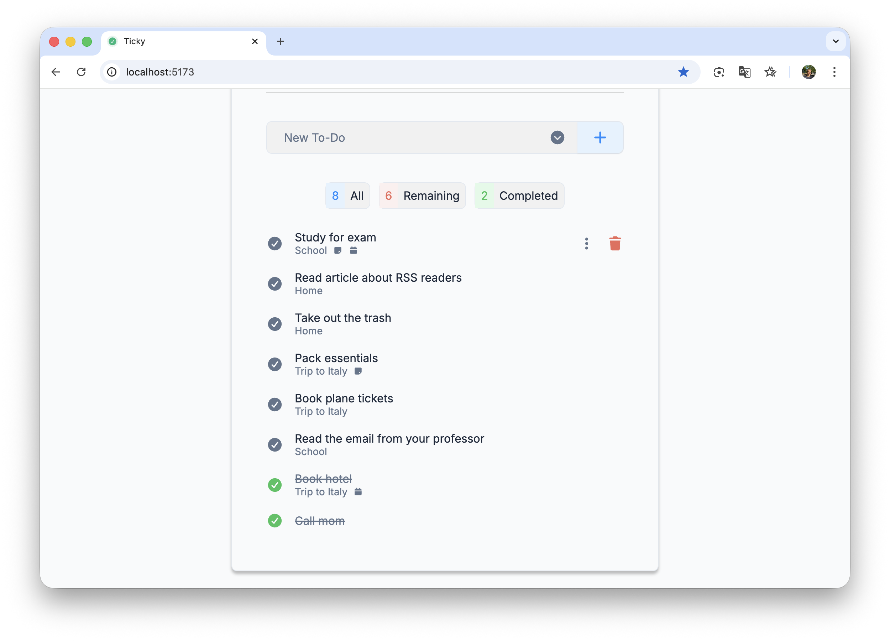
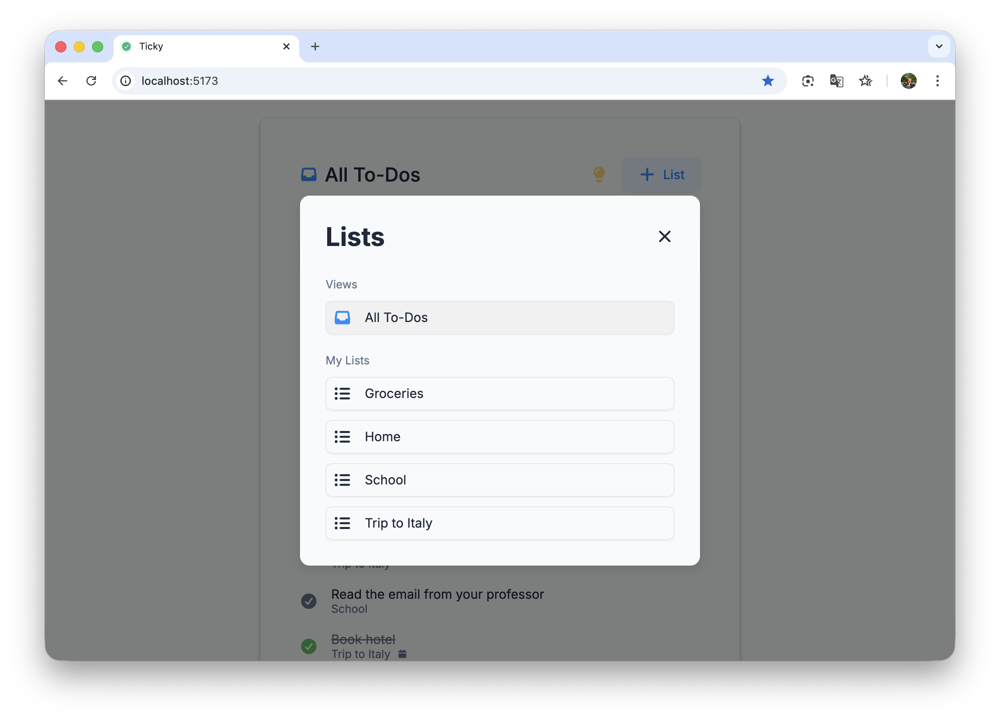
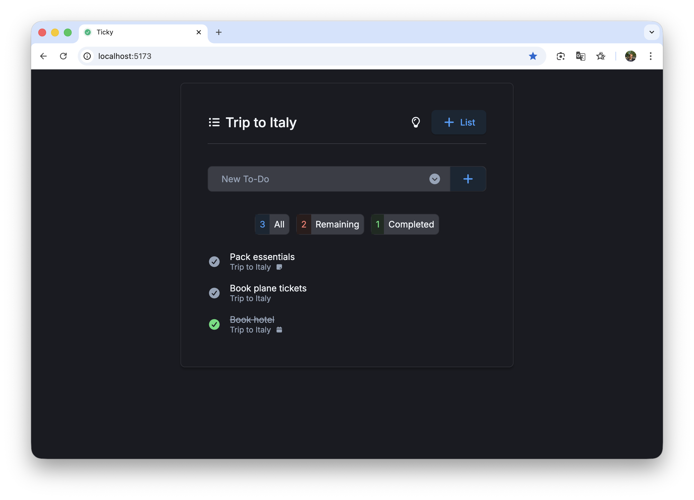
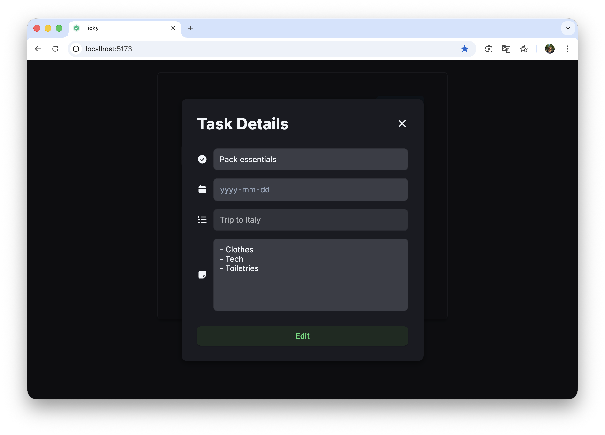
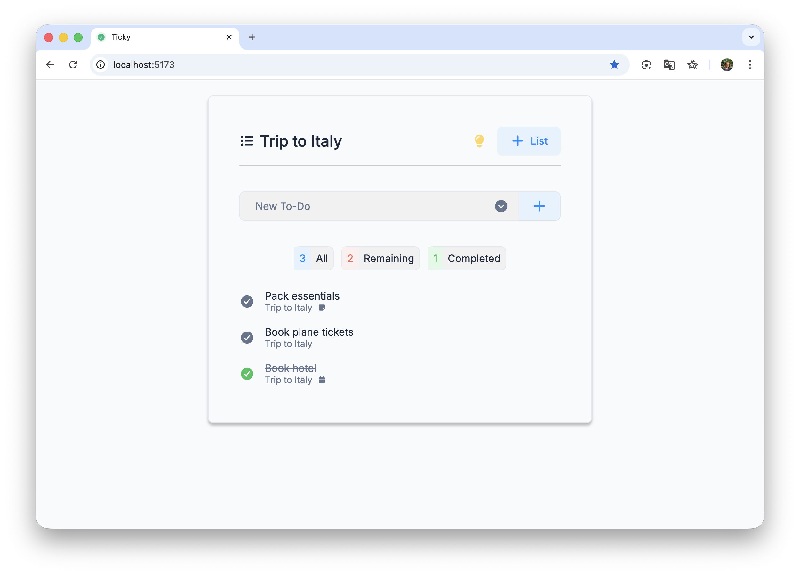
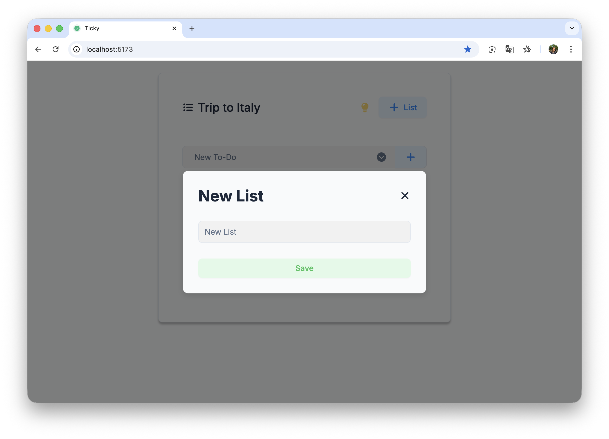

# Ticky — Personal Task Manager

A delightful and minimal personal task manager built with React and Firebase.
Ticky lets you create lists, add tasks, set due dates, and jot down notes, helping you stay organized without the clutter. It’s fast, simple, and designed to feel like a digital extension of your notebook.

## Core Features

- 📝 Create, edit, and delete **tasks**
- 📁 Create, edit, and delete **lists**
- 👀 View task details by clicking on the _ellipsis_ icon (hover on desktop, always visible on mobile)
- ➕ Quick-add tasks from the header or open the detailed add modal (title, notes, due date, list)
- ✅ Mark tasks as complete
- 📊 View stats for each list (all / remaining / completed)
- 🔍 Filter tasks by list or show all tasks
- 🗓️ Tasks are automatically sorted by due date, with completed tasks moved to the bottom.
- 🌗 Toggle **light/dark theme**, saved in local storage

## Screenshots

  
  
  
  
  
  
  
  
  
  

## Key Concepts Used

- **React Hooks** — `useState`, `useEffect`, and `useContext` to handle UI state and logic
- **Context + Provider pattern** — `ModalProvider`, `ListProvider`, `TaskProvider`, and `ThemeProvider` for global data sharing (no prop drilling)
- **Reusable components** — small, flexible components that make the app easy to maintain and extend
- **Modal composition** — one dynamic `<Modal />` that renders different kinds of content
- **Data mapping & normalization** — Firestore data (tasks/lists) mapped into type-safe, consistent shapes; normalized `listId`s, formatted dates, etc.
- **Firebase Firestore** — CRUD operations, queries, and managing `DocumentReference` vs string IDs
- **CSS variables + modules** — for theme tokens, scoped styles, and consistent design throughout the app

## Tech Stack

- React (Vite)
- Firebase Firestore
- CSS Modules + CSS Variables

## Run Locally

Firebase setup (local)

1. Create a Firebase project at https://console.firebase.google.com/ and enable Firestore.
2. Create a Web app in your Firebase project and copy the config values.
3. In the project root create a `.env.local` file (this file is ignored by git).
4. Add the Vite-style keys (example names provided in `.env.example`):

**Run**

1. Install dependencies

`npm install`

2. Start the dev server

`npm run dev`

Then open `http://localhost:5173` (or whatever Vite shows in your terminal).

## Notes

This is a personal side project made for fun and learning purposes.

Built by [Jacob Asker](https://jacobasker.com)
